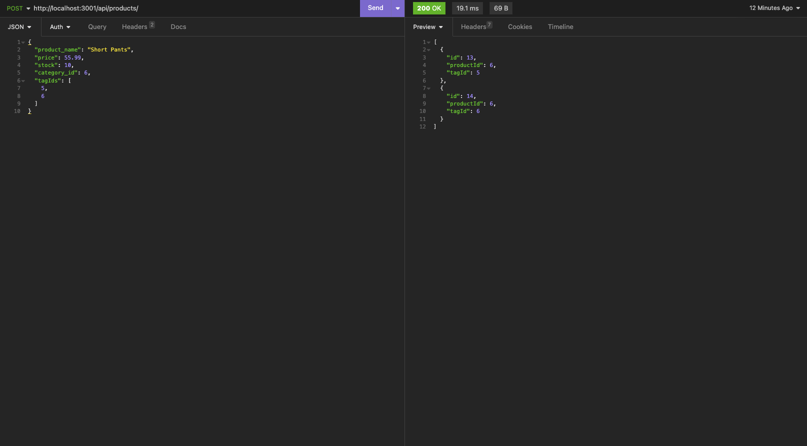

# E-Commerce Backend

  

  ## Description
  The e-commerce backend provides a simple backend for an online retail site. As a user I want to be to offer my products on my website. This application provides the backend functionality to do so.
  
  ## Table of Contents
  1. [Installation](#Installation)
  2. [Usage](#usage)
  3. [License](#license)
  4. [Contribute](#contribute)
  5. [Tests](#tests)
  6. [Questions](#questions)
  
  ## Installation
  To install the application, you will need to ensure you have mySQL installed on your server as well as Express and Sequelize. Once these are intalled you will need to run SOURCE db/schema.sql to create the database.
  
  ## Usage
  To run the e-commerce backend, ensure you have all necessary components installed as detailed in the installation section above. Once you have ensured the necessary components have been installed, you may start the backend server by running the npm start command from the terminal.

  
  
  ## License
  This software is not covered under any license.
  
  
  
  ## How to Contribute
  N/A
  
  ## Tests
  N/A
  
  ## Questions
  Github: https://github.com//bklein1981/E_Commerce_Backend
  
  Video Link: https://drive.google.com/file/d/1ACRbQf6GcAPXl5AlIgyfpaq8cClUOLQG/view
